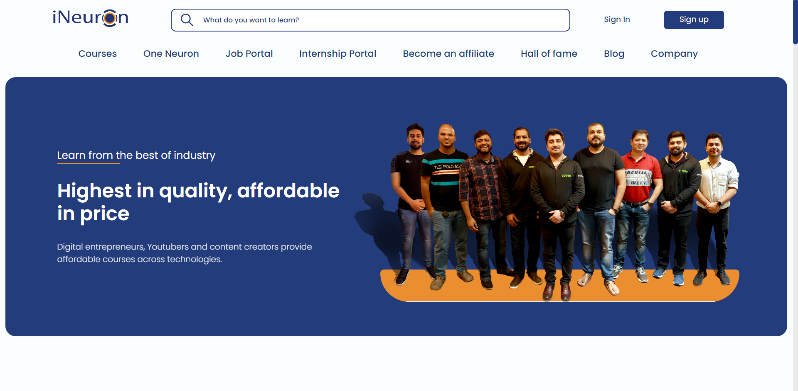
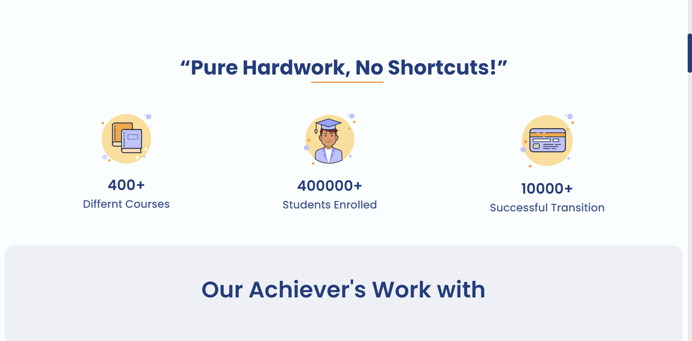
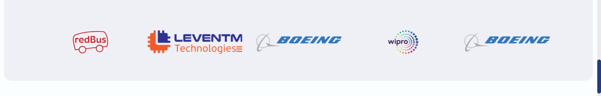
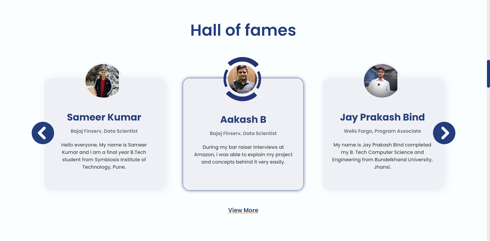
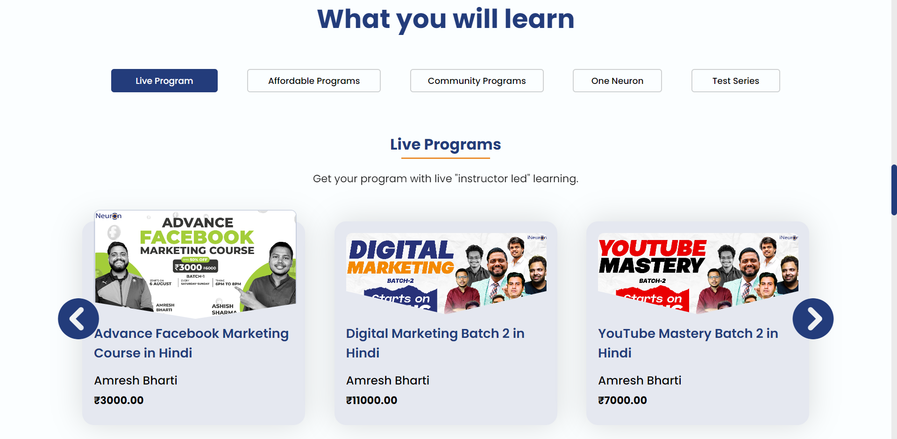
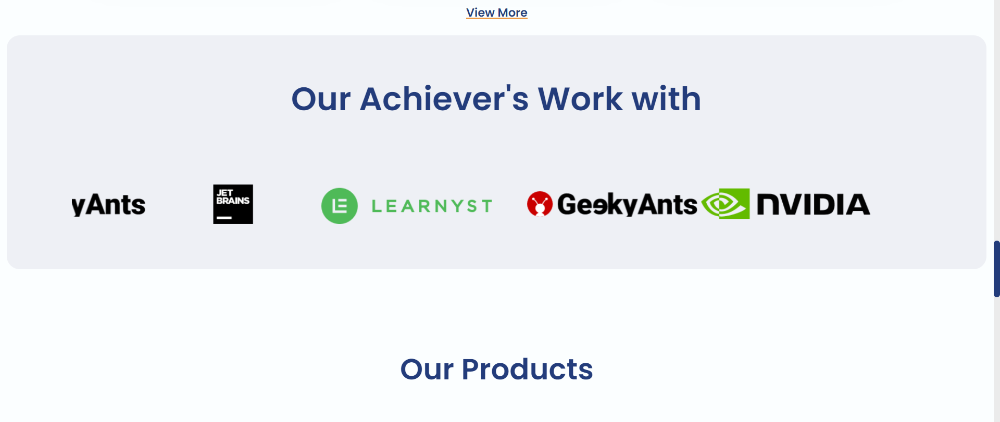
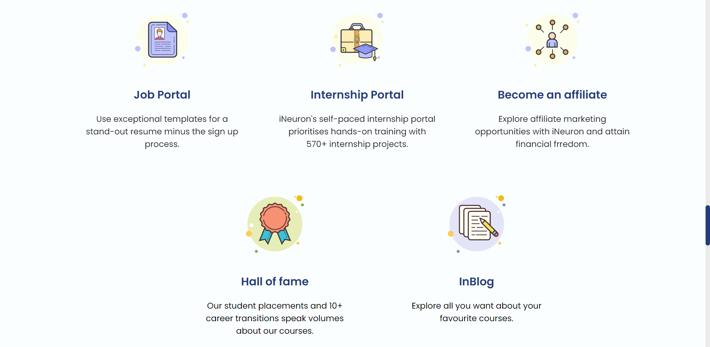
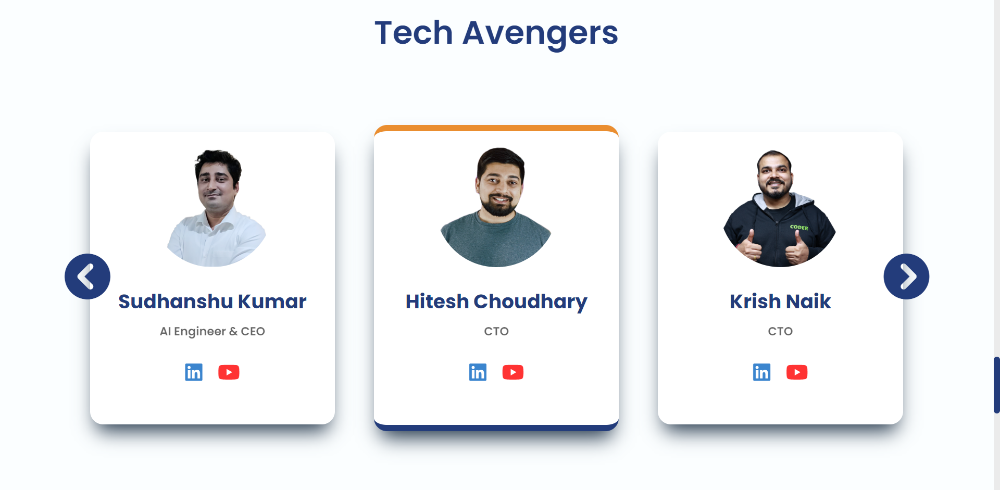
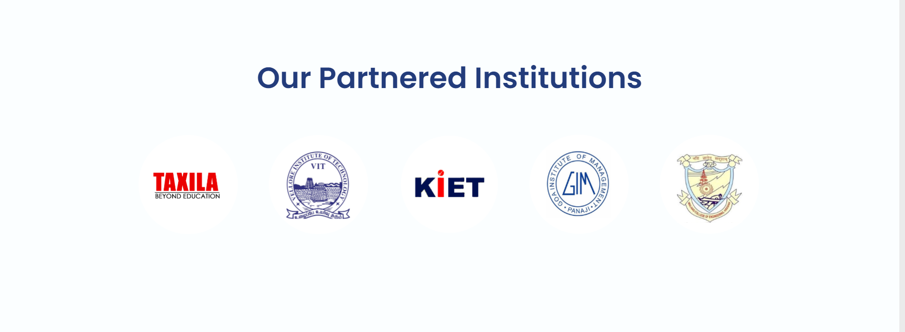
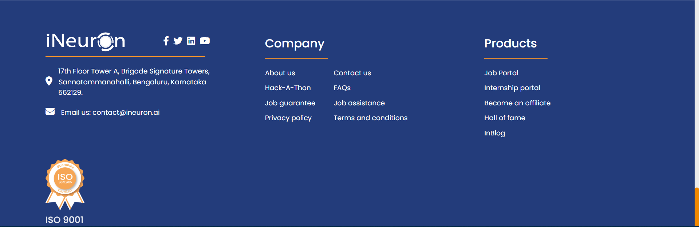

# Ineuron Live Class Hackathon
---

> Screen-Shot of the project.

#

## Built-with
---

This project is created using:

 1. HTML
 2. CSS

#

## Live Project
---

This project is hosted on Netlify.

[Netlify](https://shobhits-ineuron-live-class-hackathon.netlify.app/)

#

## Time
---

This project was built within 0 hours. It covers major portion of CSS.

#

## About
---

This website is craeted by: **Shobhit Sheta**

This Website is fully based on HTML & CSS. The concepts are which i have learnt from this live class. This website is built to upgrade interface, some effect and enhanced the website.

  